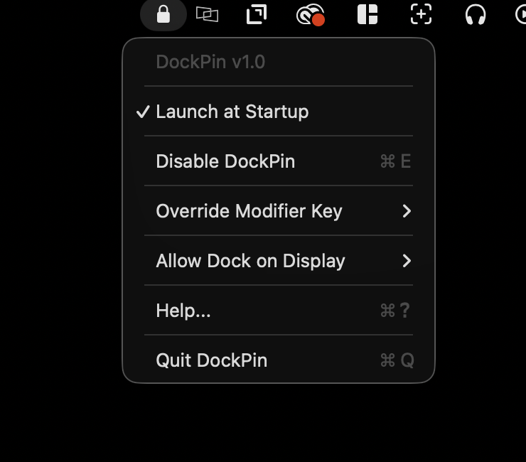
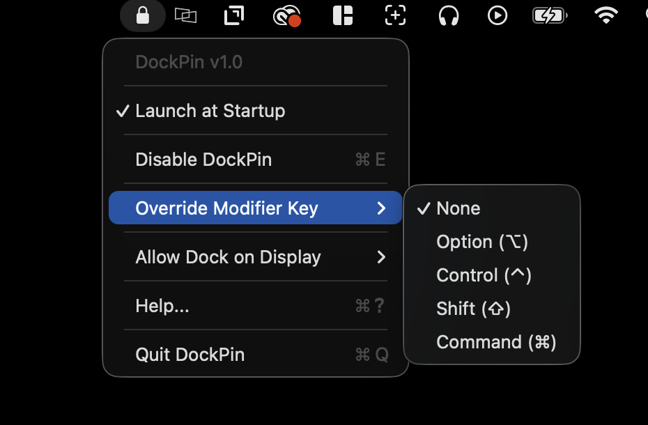

# DockPin

Pin your Mac's Dock to specific displays and prevent it from jumping between screens.

<p align="center">
  
  
  
</p>

## Features

- Lock the Dock to selected displays
- Allow or disallow specific monitors for Dock placement
- Temporarily override locking with a modifier key (Option by default)
- Launch at startup with persistent settings
- Lightweight menu bar app — no Dock icon

## Requirements

- macOS 13 or later
- Two or more connected displays
- Dock positioned at the bottom of the screen
- "Displays have separate Spaces" enabled in System Settings

## Build

```
chmod +x build.sh
./build.sh
```

The app is created at `build/DockPin.app`.

## Usage

1. Launch DockPin — a lock icon appears in the menu bar
2. Grant Accessibility permission when prompted
3. Open **Allow Dock on Display** and check the screens where the Dock is allowed
4. Click **Enable DockPin**

Hold the override modifier key (Option by default) to temporarily move the Dock freely.

## License

MIT
