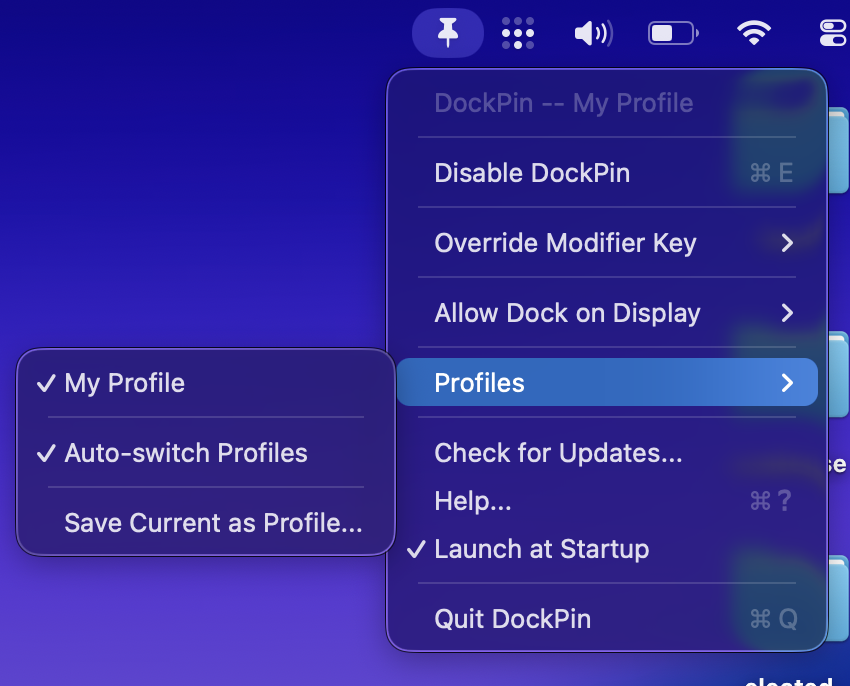

# DockPin

Pin your Mac's Dock to specific displays and prevent it from jumping between screens.

<p align="center">
  
  
  
  
</p>

## Features

- Lock the Dock to selected displays on the current macOS Dock edge
- **Display profiles** — save per-display-setup configurations and switch between them
- **Auto-switch profiles** — automatically apply the right profile when displays change
- Allow or disallow specific monitors for Dock placement
- Warn when your display arrangement blocks the current Dock edge
- Best-effort re-anchor of the Dock to a single allowed display
- Temporarily override locking with a modifier key (Option by default)
- **Automatic updates** via Sparkle
- Launch at startup with persistent settings
- Lightweight menu bar app — no Dock icon

## Requirements

- macOS 13 or later
- Two or more connected displays
- Dock positioned on the Left, Bottom, or Right edge
- "Displays have separate Spaces" enabled in System Settings

## Install

Download the latest release from the [Releases](https://github.com/green2grey/DockPin/releases) page, unzip, and drag DockPin.app to your Applications folder.

Or visit [green2grey.github.io/DockPin](https://green2grey.github.io/DockPin/) for more info.

## Usage

1. Launch DockPin — an icon appears in the menu bar
2. Grant Accessibility permission when prompted (System Settings > Privacy & Security > Accessibility)
3. Click **Set Up...**, name your first profile, and select the displays where the Dock is allowed
4. Enable DockPin from the menu

Hold the override modifier key (Option by default) to temporarily move the Dock freely.
If you allow exactly one display, use **Re-anchor Dock Now** to best-effort pull the Dock back after display changes.

### Layout Limits

DockPin can only keep the Dock on displays whose current Dock edge is exposed. Example: if the Dock is set to **Bottom** and another display sits directly below the selected monitor, macOS will not place the Dock on that monitor’s bottom edge. DockPin now warns when the current display arrangement blocks the selected edge.

### Profiles

Save different configurations for different display setups (e.g. "Office" vs "Home"). Enable **Auto-switch Profiles** to let DockPin automatically apply the right profile when your connected displays change.

## Build from source

```
git clone https://github.com/green2grey/DockPin.git
cd DockPin
chmod +x build.sh
./build.sh
```

The app is created at `build/DockPin.app`.

Requires Xcode command line tools and a Developer ID certificate for signing.

## License

[MIT](LICENSE)
